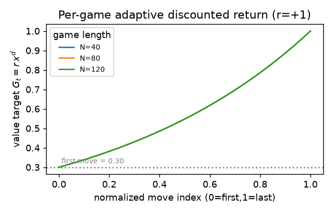
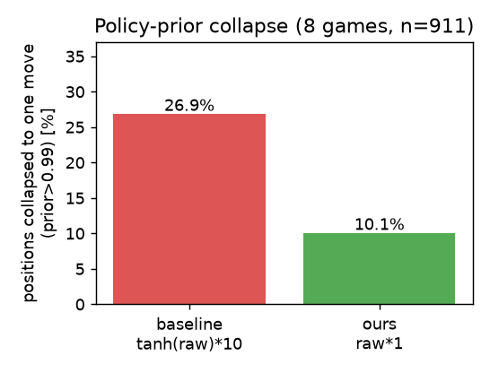
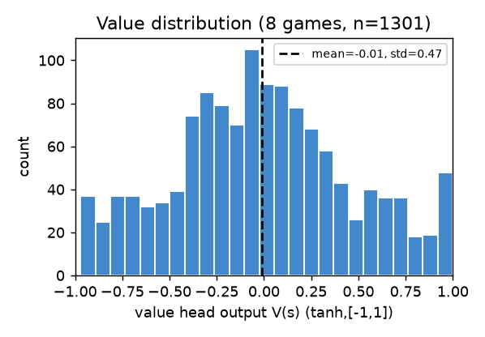

# 不完全情報に強い事前学習：実戦リプレイ模倣と相手ベリーフ探索

### — Pokémon TCG AI Battle Challenge / Strategy Category（事前学習パート）

> 本稿はチーム提出のうち **事前学習（学習データ設計と学習ロジック）** を担当パートとして報告する。デッキ構築の詳細は別稿に譲り、ここではベースライン公開コード `reinforcement-learning-and-mcts-sample-code.ipynb` を出発点に、**何を・なぜ変えたか**を差分として述べる。Simulation 部門では本パイプラインで上位約10%を得た。

---

## 1. 概要と仮説

ベースラインは Transformer 型の価値+方策ネットワークを MCTS で用いる優れた枠組みだが、学習は**単一固定デッキの自己対戦のみ**（外部データなしのコールドスタート）で、探索中の**相手の非公開札はダミーカードで1通りに固定**していた。TCG は「相手の手札・山札が見えない不完全情報ゲーム」であり、勝敗は初期手札やドローの運に大きく左右される。

そこで本パートは次の3仮説を立て、事前学習を再設計した。

- **H1（主役）**：相手の非公開情報をダミーではなく**推定分布**で具体化し、複数の想定（determinization 粒子）で探索すれば、特定の初期状態・引きへの依存が減り、繰り返し試合で安定する。
- **H2**：大量の**実戦リプレイ**を**アドバンテージ重み付き模倣（AWR）**で学べば、全手一律の模倣より一貫して強い方策が得られる。
- **H3**：終局勝敗を全局面へ一律付与するのではなく、**対局ごとに適応する割引リターン**で信用割当すれば、価値推定が安定する。

---

## 2. 学習データ

ベースラインの自己対戦を、**公式日次リプレイの全量**による事前学習に置き換えた。index データセットから日次データセットを取得し、`episodes/` に格納した（`download_daily_dataset.py`、再帰的 zip 読み取り）。

- 規模：**2026-07-01〜08-15 の46日分・総 218,366 ゲーム**（1日あたり 4,340〜5,333）。
- 実戦データを使う狙い：多様な相手・実際のメタ・マッチアップを含む強い教師でコールドスタートを回避する。

さらに、実デッキを**16のアーキタイプ（クラスタ）**へ階層クラスタリングし（類似度閾値0.75）、クラスタ単位で **own（そのデッキを使った側の手）** と **opp（そのデッキと対戦した相手の手）** を分けて抽出した。各局面はスパース特徴へ変換しシャード化する（`preprocess_shards.py`）。

抽出される意思決定サンプル数はアーキタイプ間で極端に偏る（**表1**）。この偏りは戦略的に重要で、データが潤沢な主要アーキタイプ（cl00 等）は十分学習できる一方、希少デッキ（cl15 は数百局面）は単独学習が困難であり、**提出は最もデータの厚い cl00 アーキタイプに集中**した。

**表1：アーキタイプ別 抽出サンプル数（own、代表値）**

| クラスタ | own サンプル | | クラスタ | own サンプル |
|---|--:|---|---|--:|
| cl00 | 5,897,867 | | cl08 | 380,291 |
| cl01 | 4,191,551 | | cl10 | 153,675 |
| cl02 | 1,288,681 | | cl12 | 18,632 |
| cl04 | 1,003,201 | | cl14 | 4,010 |
| cl05 | 921,341 | | cl15 | 655 |

*（16クラスタ合計 約1,530万サンプル。約4桁の偏りがある。）*

---

## 3. 強化学習ロジック：ベースラインとの差分

**表2：ベースライン vs 本手法（事前学習）**

| 観点 | ベースライン | 本手法 |
|---|---|---|
| 学習データ | 単一デッキの自己対戦のみ | 公式リプレイ 46日 / 21.8万戦 |
| デッキ | 固定1種 | 16アーキタイプ別に self/opp |
| policy 教師 | 自己対戦 MCTS の Q優位度回帰 | 実戦手の **AWR**（優位度重み模倣） |
| policy 頭・prior | tanh 出力 → `exp(policy×10)` | **tanh 除去 + 温度較正（×1）** |
| value 教師 | TD(λ=0.9) ブートストラップ | **対局適応の割引リターン**（1手目≈0.3） |
| 相手の非公開札 | **ダミー固定（1通り）** | **候補DB推定+手札追跡+学習モデルで K=3 粒子** |

### 3.1 【主役】相手ベリーフに基づく determinization 探索

ベースラインは探索開始時、相手の山札を「カビゴン」、手札・サイドを「基本エネルギー」で埋める。実在しない1通りの想定で、しかも毎回同じため、相手の脅威も自分の引きも現実を反映しない。

本手法は相手の非公開状態を**推定分布**として扱い、次の手順で具体化する。

1. **相手デッキ推定**：公開済みカードを候補デッキDB（738デッキ）と照合し、整合する実在デッキを推定する（`deck_reconstructor`）。
2. **確定手札の追跡**：対戦ログのカード移動を辿り、サーチ後も手札に残ると確定するカードを保持する（`OpponentHandTracker`）。
3. **未知札のサンプリング**：残余から、学習済みの**手札保持モデル**で「相手が抱えていそうな札」の確率を補正しつつ非公開手札・山札・サイドを引く。
4. **多粒子探索**：以上で **K=3 個の異なる完全情報の想定（determinization 粒子）** を作り、各々で MCTS を実行、ルートの訪問数を合算して最終手を決める。

これは不完全情報を明示的に**周辺化**する設計で、審査観点「特定の初期状態・マッチアップ・状況優位への過度な依存を避ける」に直接対応する。1通りの決め打ちで最善に見える手ではなく、**複数の起こりうる盤面で平均的に良い手**を選ぶため、相手の引きや自分の初手に対して頑健になる。

### 3.2 実戦リプレイ模倣 × AWR（advantage-weighted imitation）

ベースラインの policy 教師は自己対戦 MCTS の Q優位度回帰である。本手法は**実際に打たれた手**を教師にしつつ、勝敗に応じて重み付けする：局面価値をベースラインとする優位度 `A = G_t − V(s)` から `weight = exp(A_norm/β)` を作り、**勝ち筋の手を強く・負け筋の手をほぼ学ばない**（オフライン強化学習 AWR に相当）。全手を一律に真似る素朴な模倣が「負け試合の悪手」まで強化してしまう問題を避ける。

**技術的健全性（設計修正）**：ベースラインは policy 頭に tanh をかけ、推論で `exp(policy×10)` により prior 化する。この温度は自己対戦の小さな回帰目標には合うが、**模倣で学んだ重みでは prior が飽和**し、探索が事実上1〜2手に潰れて MCTS の探索項が死ぬ。本手法は **policy 頭の tanh を除去し温度を較正（×1）** した。同一モデルの生ロジットに両変換を適用して 8 ゲーム・911 局面で計測すると、**ベースライン流の変換は 26.9% の局面で prior が1手に集中（one-hot 化）するのに対し、本手法では 10.1%** に留まる（**図2**）。探索が候補手全体に行き渡ることが定量的に確認できた。

### 3.3 対局適応の割引リターン（value 教師）

ベースラインの value は TD(λ=0.9) でモデル自身のルート値をブートストラップする。本手法は**終局勝敗からの割引リターン** `G_t = r · x^d` を教師とし、割引率を**対局ごとに** `x = (0.3)^{1/(N-1)}` と定める。これにより対局長 N に依らず**最初の手が常に約0.3・終局直前が±1**に正規化される（**図1**）。序盤の互角な局面に±1 を貼って価値頭を過信させる（飽和させる）ことを避け、終盤ほど確信を強める自然な信用割当になる。実測では価値頭出力は mean −0.01・**std 0.471** と ±1 に張り付かず十分な分解能を保った（**図3**）。

### 3.4 アーキタイプ別 self/opp デュアルモデル

探索木の自分の手番は self モデル、**相手の手番は opp モデル**（そのアーキタイプと対戦した相手の打ち方を学習）で評価する。相手の応手をより現実的に読むことで、マッチアップを踏まえた探索になる。3.1 の相手ベリーフが「どんな盤面か」を、opp モデルが「相手がどう指すか」を担う二層構成である。

---

## 4. 実験・根拠

すべて cl00 の学習済みモデルで実測した（数値は実行結果、8 ゲーム・1,301 局面）。

- **図1 割引リターン曲線**：1手目=0.30、中盤≈0.55、最終手=1.00。N=40/80/120 で一致し、対局長非依存の信用割当を確認。
- **図2 prior の1手集中率**：ベースライン流変換 **26.9%** → 本手法 **10.1%**。温度・tanh 較正で探索の崩壊が約1/3に減少。
- **図3 価値頭の分布**：mean −0.01 / std 0.471 / 範囲 [−0.97, +1.00]。±1 飽和を回避し分解能を維持。
- **外形的検証**：本パイプラインで Simulation 部門 上位約10%。

---

## 5. まとめ

事前学習の設計を、ベースラインの「単一デッキ・自己対戦・相手はダミー」から、**実戦リプレイのアドバンテージ重み付き模倣**・**対局適応の割引リターン**・**相手ベリーフに基づく多粒子探索**へ拡張した。中でも相手の非公開情報を推定分布として周辺化する探索は、TCG の不完全情報という本質に正面から対応し、初期状態や引きへの依存を下げて安定性を高める狙いである。温度較正・割引リターンの効果は定量計測で裏付けた。
